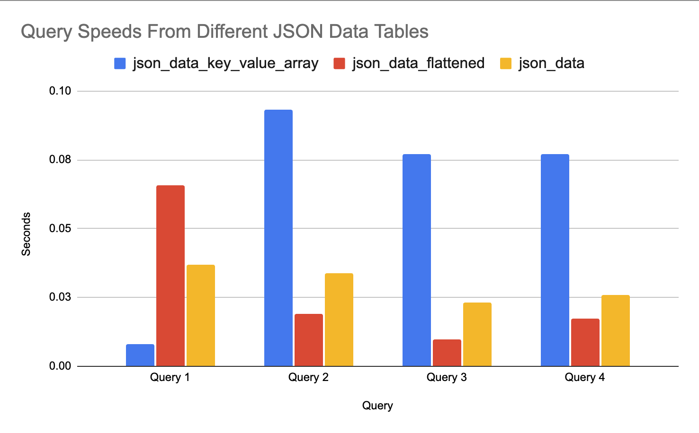

# Overview

Analysing JSON data has been a significant challenge for large companies, with organizations like Uber ingesting millions of logs per second and eBay storing multiple petabytes of logs each day, all in JSON format. Building analytics with this large, complex data can be inefficient and complicated. This repository explores three technique for ingesting JSON data from GCP Cloud Run and formatting it in a fixed schema within Clickhouse.

## Approaches

### Approach One: Single JSON Object

The first approach - `json_data` - is the table store the JSON data as a JSON object in a column called `_source`. Each row in the `_source` column contains a JSON object that has every field seen in the entirity of the data; therefore, there is quite a lot of fields containing there default value (e.g "" and None). 

### Approach Two: Flattened JSON Data

The second approach - `json_data_flattened` - flattens the JSON data, and creates a table of columns representing each terminal path within the JSON dataset. For example, the location of requests coming into the GCP Cloud Run instance can be found in the `_source.protoPayload.request.service.metadata.labels.cloud.googleapis.com/location` column. Flattening the JSON data like this significantly improves query speed, up to 5x-10x faster than approach one and two. However, it doesn't scale well due to linear growth in the number of disk files as new JSON fields are identified. To prevent INSERT query failures with new fields, you can use `input_format_skip_unknown_fields=1`, though this discards data from new, unknown fields.
 
### Approach Three: Key-Value Arrays

The third approach - `json_data_key_value_array` - flattens logs into key-value pairs grouped by value types (String, Number, Boolean, etc.), stored in paired arrays. It keeps common metadata in dedicated columns for quick access, maintaining raw logs in a `_source` column for full log reconstruction when needed. This dual storage approach leverages Clickhouse's array functions for fast field value access.

## Data

The data analysis revealed varying performance across different storage approaches:

- **Query Performance**: Initial tests showed that `json_data_flattened` performed fastest but - as mentioned above - this approach has many scalability and reliability issues. The `json_data` approach is surprising fast, performing ~3x faster than `json_data_key_value_array`. 

| database | table                      | compressed | uncompressed | compr_rate | rows   | part_count |
|----------|----------------------------|------------|--------------|------------|--------|------------|
| default  | json_data_flattened        | 6.68 MiB   | 119.20 MiB   | 17.84      | 249700 | 3          |
| default  | json_data                  | 6.65 MiB   | 120.59 MiB   | 18.14      | 249700 | 3          |
| default  | json_data_key_value_array  | 3.04 MiB   | 387.96 MiB   | 127.44     | 249700 | 3          |

- **Data Compression: No Table Order Key**: The `json_data_key_value_array` approach is the worst in terms of query speed; however, it demonstrated significantly better compression rates, possibly indicating its efficiency for large-scale JSON log data storage and analysis. The `json_data_key_value_array` table was nearly 3x bigger when uncompressed compared to the other tables but once compressed took up less than half the storage space. Note, the metrics above are without specifying an `ORDER` key during table creation. To learn more about why this impacts compression, read (How to improve Clickhouse table compression)[https://medium.com/datadenys/how-to-improve-clickhouse-table-compression-697ef8f4ccb3]. 

- **Data Compression: With Table Order Key**: To showcase how well the `json_data_key_value_array` approach can compress data, the table below shows a comparison between `json_data_key_value_array` and `json_data`. I wrote a python script that duplicated my GCP Cloud Run logs 5000 times and inserted it into each table. As you can see the uncompressed version of `json_data_key_value_array` is ~4x bigger than `json_data`; however, once compressed `json_data_key_value_array` is 1/3 the size of `json_data`. Note, the `json_data_key_value_array` table only used timestamp as an `ORDER` key as the GCP Cloud Run data is quite simple (i.e only one project id, revision name, location, etc). With more complicated data, a more complex `ORDER` key will give you even better compression compared to storing data as a JSON object. 

| database | table                      | compressed | uncompressed | compr_rate | rows   | part_count |
|----------|----------------------------|------------|--------------|------------|--------|------------|
| default  | json_data                  | 148.83 MiB   | 2.68 GiB   | 18.14      | 5675000 | 1          |
| default  | json_data_key_value_array  | 55.67 MiB   | 10.45 GiB   | 192.24     | 5675000 | 1          |

## Improvements
- Test With More Complicated/Diverse Data: My data was very primitive as it wasn't from a popular production app. For example, the metadata fiels in the `json_data_key_value_array` table only really had one or two values; meaning implementing skip indexs or using them as `ORDER` keys wouldn't really make a difference. However, these strategies promise huge improvements on complicated, diverse data. 
- Materialized Columns: Implementing a materialized column, for any commonly used JSON field can significantly speed up filtering and sorting operations.
- Skip Index Implementation: The `json_data_key_value_array` approach enable you to implement a skip index that radically improves query performance. 
- `ORDER` Key Adjustment: Fine-tune the ORDER BY clause in the table creation statement to improve data compression and query efficiency.